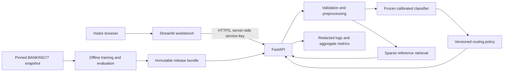

# TriageDesk: production ML project implementation plan

**Prepared:** 7 September 2026  
**Implementation agent:** GPT Luna, Extra High reasoning  
**Learner:** engineering student who has completed classical ML in Hands-On Machine Learning and is learning deep learning with D2L  
**Deliverable:** a complete, tested, polished, deployed application, plus a readable reference implementation and learning guide  
**Status of this document:** specification only; nothing has been trained, measured, or deployed yet.

## 1. Read this first: instructions to the implementation agent

Build **TriageDesk**, an English-language banking support message classifier and routing workbench. Use classical ML, FastAPI, Streamlit, Docker, and CI/CD. Follow this document through deployment and verification. Do not finish after creating a scaffold, notebook, Dockerfile, or deployment instructions.

The user has already built bike-demand forecasting. Do not substitute a forecasting project. The purpose is to learn professional ML engineering through a different, understandable application.

Work in small vertical slices. At each milestone, run the relevant checks, fix failures, and update `docs/implementation-status.md` with evidence and the next unfinished step. Continue without asking the user to choose routine libraries, filenames, styling, or implementation details. Read existing repository instructions first, preserve unrelated work, and adapt to existing files where appropriate.

The project choices below are intentional defaults. Change one only for an actual compatibility issue, measured limitation, or explicit user preference. Record consequential changes in an architecture decision record (ADR). Do not inflate the stack just to add résumé keywords.

### Rules that govern completion

1. Train on the actual licensed dataset. Mock models are allowed only in isolated tests.
2. Every displayed performance number must come from a saved evaluation of the released artifact. Never invent accuracy, latency, business savings, users, uptime, screenshots, or deployment URLs.
3. Do not describe logits, SVM margins, similarity scores, or raw softmax values as calibrated confidence.
4. Keep the official test set out of fitting, tuning, calibration, routing-threshold selection, and evidence retrieval.
5. Deliver a real inference service. The UI must call FastAPI over HTTP; it must not load a second model or return hardcoded predictions.
6. Public visitors must be able to try the application without an account or API key. Backend credentials remain server-side.
7. Finish the core project before implementing any optional extension.
8. Do not purchase hosting or create billable resources without an approved budget. Existing explicit authorization continues to apply. Prepare and validate the release before requesting any missing external access or spending approval.
9. If deployment access is unavailable, complete all local, container, documentation, and CI work that can be completed. Report deployment as blocked with the exact remaining action. A deployable repository is not a deployed application.
10. Keep this plan as the specification. Record progress separately rather than checking off unverified requirements here.

### First actions

- Inspect the repository, instructions, available runtime, Docker availability, Git remotes, and deployment tooling.
- Record the chosen Python and dependency versions after checking compatibility. Start with Python 3.12 unless a concrete reason requires another supported version.
- Create the status document, an initial task checklist, and the repository structure.
- Start the local implementation immediately. Discover available GitHub/hosting access without printing secrets.
- When useful, request only the missing deployment facts: intended GitHub repository, permitted hosting account/region, and monthly budget. These facts do not block model development or local testing.

## 2. Product definition and why this project is useful

### User and problem

The product is a workbench for a support operations analyst. The analyst receives short messages, determines their intent, assigns an appropriate support queue, and reviews uncertain cases.

Example invented input:

> “I ordered a replacement card last week and it still hasn't reached me.”

The application returns a predicted intent, suggested queue, calibrated confidence, alternatives, and a routing disposition. The analyst can inspect similar public training examples, accept or correct the suggestion within the current session, and export decisions.

It does not contact a bank, move money, resolve the complaint, create a real support ticket, or send messages to anyone. “Routing” means a routing recommendation and an exportable decision. Use that wording consistently.

### Core product promise

**Turn a message or CSV of messages into explainable routing recommendations, with explicit human review when the system is uncertain.**

This project demonstrates classification, sparse NLP features, calibration, selective prediction, reliable serving, product design, testing, and operations. These are concrete engineering competencies; there is no universal recruiter checklist or guarantee that a particular stack wins interviews.

A RAG chatbot is not required for production ML. V1 deliberately has no generative answer component: the dataset provides intent labels, not verified solutions. Similar examples provide routing context, not banking policy or answers. This is retrieval-assisted classification, not RAG. Section 21 describes a genuine optional RAG extension after v1 is finished.

### Scope of “production ready”

Build a **production-engineered, low-traffic, stateless inference application with a public portfolio demo**. It must have reproducible artifacts, bounded requests, correct failure behavior, secrets management, observability, deployment verification, and a recovery path.

It is not a bank-approved system, enterprise support platform, or independently audited service. Benchmark performance does not establish performance on a bank's real traffic. Real adoption would additionally require representative labeled data, privacy review, authenticated users, persistent audit trails, access controls, and operational ownership.

The stateless boundary is deliberate: no server-side customer-message archive and no database in v1. Review work is session-local and exportable. Closing/reloading the session may lose it. Say this clearly before the user starts a batch.

### Mandatory capabilities

| Capability | Observable behavior |
|---|---|
| Single-message triage | Input text produces intent, queue, top alternatives, confidence, and disposition |
| Human review | Low-confidence and policy-sensitive cases visibly require review |
| Evidence | Up to three similar eligible training examples with labels and similarity, or an honest empty state |
| Batch workflow | Validated CSV, row-level results, progress, filters, corrections, export |
| Evaluation view | Real held-out metrics, confidence/coverage tradeoff, error analysis, limitations |
| Developer view | Working API documentation and downloadable example requests |
| Reliability | Readiness checks, bounded workload, structured errors, logs, smoke tests, rollback |
| Learning material | Architecture, walkthroughs, exercises, model/data cards, runbooks |

### Explicitly outside v1

No PyTorch model, LLM API, vector database, Kubernetes, Kafka, Redis, Celery, user accounts, billing, email integration, live ticket ingestion, persistent review queue, or automatic retraining. Do not add sentiment or urgency predictions: this dataset does not supply ground truth for them.

## 3. Data source, provenance, and cleaning

Use **BANKING77** from PolyAI's original repository. The publisher reports 10,003 training examples, 3,080 test examples, and 77 intents under CC BY 4.0. Preserve attribution and record any transformations. [Publisher repository](https://github.com/PolyAI-LDN/task-specific-datasets)

The dataset is English, single-domain, and fine-grained. Its performance is not evidence of multilingual, general customer-support, or reliable out-of-domain detection. The Hugging Face dataset page currently reports a legacy dataset-script loading issue; use the publisher's raw CSV/JSON files at a pinned commit instead of depending on remote dataset-script execution. [Dataset card](https://huggingface.co/datasets/PolyAI/banking77)

### Fetching contract

Implement `python -m triagedesk.cli fetch-data`:

1. Resolve and record a concrete upstream commit on first setup. Check in that revision and the expected file digests in `configs/data-source.json`.
2. Download the train/test files and authoritative category list from that commit using HTTPS, explicit timeouts, bounded retries, and maximum download sizes.
3. Verify SHA-256 before accepting cached or newly downloaded files. Initial digests document the first inspected snapshot; do not imply they independently authenticate a source without an upstream signature.
4. Write to a temporary location and atomically rename after validation. An interrupted download must not be mistaken for valid data.
5. Preserve raw data unchanged under ignored `data/raw/`. Never download data on an inference request or at application startup.
6. Produce a manifest with source URLs, commit, file hashes, UTC retrieval time, license, observed counts, and schema.
7. Include publisher attribution, paper citation, license link, and a modifications statement in `DATA_LICENSE.md` and the data card. Give repository code its own license; do not imply that this relicenses the dataset.

### Data validation

Check schema, required columns, UTF-8 handling, nonempty text, allowed labels, label counts, and train/test provenance. Fail with a clear message if upstream data differs from the pinned contract.

Use canonical label strings from the upstream category list. Some label names may have unusual case or punctuation: keep stable upstream IDs and create separate friendly display names. Never rely on an assumed numeric class order.

Create a deterministic duplicate key using Unicode normalization, whitespace collapsing, and case-folding. Audit exact normalized duplicates and conflicting labels. Preserve raw row IDs and all removal reasons.

- Collapse same-label duplicates within training deterministically.
- Quarantine conflicting-label training groups and document counts.
- Remove normalized training duplicates of official test text from all development subsets before splitting. This is a fixed leakage audit, not a reason to inspect test errors or optimize against test labels.
- Preserve the official test rows for the primary evaluation. Also report a unique-text sensitivity evaluation if duplicates are present, with its own denominator.
- Audit near-duplicate risk with a documented fixed similarity rule. Do not repeatedly alter the dataset in response to test scores. Record unresolved near-duplicate limitations.

Raw publisher counts and cleaned modeling counts are different quantities; show both. Do not silently hardcode the raw counts after cleaning.

### Text preprocessing

Have one importable preprocessing function used in both training and serving:

- normalize Unicode consistently;
- trim and collapse whitespace;
- retain negation, useful punctuation, and words such as “not”;
- use conservative, tested masking for obvious email addresses and long account/card-like number strings;
- do not claim masking catches all personal information;
- do not strip all non-ASCII characters or pretend this makes the system multilingual;
- apply case handling consistently with the vectorizer configuration.

Avoid stemming and stop-word removal by default. Fit vocabulary and IDF only on the model-fitting subset, inside the pipeline. Record normalization/masking version in the artifact manifest.

Create a PII-screened retrieval view from the fitting subset only. Exclude suspicious examples rather than displaying risky text. This can be smaller than the training corpus. Do not store user submissions in this reference corpus.

## 4. Evaluation design: separate four different decisions

Freeze split IDs in `data/manifests/splits.json` and record the seed. After duplicate handling, partition **only the official training data**, stratified by label:

| Partition | Approximate share of cleaned official train | Permitted use |
|---|---:|---|
| Fit | 70% | Feature fitting, inner cross-validation, final base estimator fitting, retrieval index |
| Calibration | 15% | Fit the probability calibrator for the selected frozen base model |
| Policy validation | 15% | Select confidence/margin thresholds and assess the routing policy |
| Official test | Unchanged separate upstream split | One final evaluation after the model and policy are frozen |

Save actual per-class counts; percentages are approximate. Every partition must contain all 77 classes. Keep any retained duplicate groups together. If cleaning makes the proposed split infeasible, document a deterministic adjustment before model selection.

### Model selection

Use three-fold stratified CV within `fit`. The **entire text pipeline** must be fit separately inside each fold. Select by mean macro-F1; use simplicity, memory, and inference time as tie-breakers. Save fold results and timing.

After selection, fit the chosen base pipeline on all `fit` rows. Do not refit on calibration or policy-validation data after selecting a policy. Such a refit changes the model and invalidates its calibration and thresholds.

### Final test discipline

Freeze the estimator, calibrator, preprocessing, route mapping, and threshold policy before evaluating the official test. Save a release-candidate configuration hash. Re-running the same artifact's deterministic evaluation is permitted; tuning against its test failures is not an independent test.

If later error analysis inspires improvements, report the test as previously observed and maintain a separate future holdout or newly collected evaluation set. Never move test examples into fitting to improve a résumé score.

### Metrics to produce

- Top-1 accuracy, macro-F1, weighted-F1, and top-3 accuracy.
- Per-intent precision, recall, F1, and support.
- A full machine-readable confusion matrix and a readable view of the most confused pairs.
- Multiclass log loss, a defined multiclass Brier score, and top-label calibration error.
- Reliability plot: fixed confidence bins, mean predicted top-class probability, observed correctness, and bin counts. Define treatment of empty bins.
- Coverage: automatic-routing recommendations / valid evaluated messages.
- Selective accuracy: correct automatic-routing recommendations / automatic-routing recommendations.
- Review rate: review recommendations / valid evaluated messages.
- Wilson 95% confidence interval for selective accuracy, with accepted sample count.
- Risk–coverage curve on policy validation; mark the frozen operating point on held-out test results.
- Latency and memory measurements with the hardware, input sizes, and concurrency disclosed separately from predictive metrics.

Treat zero accepted cases as undefined selective accuracy, not 100%. Report `null` plus an explanation in machine-readable output. Do not conflate queue accuracy with fine-grained intent accuracy.

Create an explicitly synthetic robustness suite before tuning the review policy: ambiguous banking messages, unrelated domains, typos, Unicode, empty-like input, multi-intent messages, and unusually long text. Separate development examples from held-out synthetic examples. Report its size and authorship. It is a smoke test of limitations, not a representative out-of-domain benchmark.

## 5. Models and bounded experiment budget

Implement these candidates:

1. `DummyClassifier` to establish a trivial baseline.
2. Word TF-IDF + logistic regression as a meaningful simple baseline.
3. Word + character TF-IDF + linear SVM as the main candidate.

Suggested feature configuration:

- Word TF-IDF: unigrams/bigrams, `min_df=2`, `sublinear_tf=True`, bounded vocabulary.
- Character TF-IDF: `analyzer="char_wb"`, 3–5 grams, bounded vocabulary.
- Combine with `FeatureUnion`; preserve sparse matrices throughout.
- Start with at most 30,000 word features and 50,000 character features. Reduce if measured memory or deployment constraints require it.
- Fix randomness where available. Set solver iteration limits; investigate convergence warnings rather than suppressing them.

Bound the search to approximately 12 configurations across the two real models, for example a few regularization strengths and word-only versus combined features. Do not conduct an unlimited search or introduce a GPU dependency. Save configuration, CV results, runtime, and environment for every candidate.

### Calibration

For the selected, already fitted base pipeline, use sigmoid calibration on the separate calibration partition. Use the supported frozen-estimator API for the pinned scikit-learn version. Keep preprocessing frozen as well as classifier weights. Official documentation places responsibility on the implementer to keep fitting and calibration data disjoint. [Calibration API](https://scikit-learn.org/stable/modules/generated/sklearn.calibration.CalibratedClassifierCV.html)

Compare uncalibrated versus calibrated probabilities where mathematically available; an SVM's raw margin is not a probability. If calibration changes top-1 decisions, report the released calibrated model's classification performance, not just the better base model result.

Acceptance checks: each probability is finite and in [0,1], rows sum to one within tolerance, class labels align with probability columns, and serialization round-trips preserve outputs within a declared tolerance.

## 6. Routing policy and human review

Store a complete mapping in `configs/routes.yaml`, with one entry for each upstream intent:

- stable intent ID;
- friendly name and short description;
- suggested queue;
- `mandatory_review` boolean;
- a short rationale for policy-sensitive mappings.

Use approximately seven understandable queues: Cards, Card Payments, Transfers, Cash & ATMs, Top-ups, Account & Verification, and Security Review. Resolve overlaps explicitly after reading all 77 definitions. This grouping is an application-design choice, not a dataset annotation or a real bank's organization chart.

Require review for security-related intents such as compromised cards, lost/stolen cards or phones, and unrecognized transactions. Decide the complete list from the canonical taxonomy and document it. These rules do not establish reliable fraud detection and must never trigger financial actions.

### Decision order

1. Reject invalid requests with a structured validation error.
2. For valid text with no usable features, return `review_required` with reason `no_supported_features`.
3. Compute calibrated probabilities and top-three intents.
4. If the top intent has mandatory review, return `review_required` with reason `policy_review`.
5. Otherwise recommend automatic routing only if the frozen confidence and top-two margin thresholds both pass and automation is enabled for this release.
6. All remaining valid cases return `review_required`, with `low_confidence` and/or `ambiguous_intent` as applicable.

The suggested intent may still be shown for a review case, but `recommended_queue` must be `Human Review`; keep the classifier's mapped queue separately as `suggested_queue`. Never display a confident green success state for a review decision.

### Threshold selection

On policy validation only, search a small fixed grid of confidence and margin thresholds. Maximize coverage subject to:

- selective accuracy at least 95%;
- Wilson lower 95% bound at least 90%;
- at least 200 accepted messages.

These are project policy targets, not promised model results. Include mandatory-review rules in coverage calculations. Record the selected thresholds, numerator/denominator, and policy-validation metrics in `policy.json`. Prefer one global policy; there is too little data to justify 77 independently tuned thresholds.

If no operating point passes, ship **assist-only mode**, where every case requires human review. Show useful suggestions and honest measured quality. Do not quietly lower the threshold target, show 95% as a measured result, or declare completion of an automatic-routing quality gate that failed.

The official test measures the frozen policy. A substantial test shortfall must be visible in the model card and release decision. For v1, disable automatic routing if held-out selective accuracy is below 90% or accepted count is below 100; record this as a conservative release veto, not a new test-tuned threshold. Preserve the original policy's test report even if the UI releases in assist-only mode.

Confidence thresholds cannot reliably detect every unfamiliar or adversarial message. Say that in the UI's limitations and demonstrate failure examples in the learning guide.

## 7. Evidence retrieval and explanations

Use the selected base pipeline's sparse feature representation and cosine similarity against the PII-screened `fit` examples. Normalize consistently and precompute the reference sparse matrix offline. Return at most three examples above a fixed documented minimum similarity, with example ID, text, known intent, and similarity.

Do not filter references to the predicted class before retrieval; showing genuinely similar examples from another class can reveal ambiguity. Break ties deterministically. Label the panel **Similar training examples**, not “proof,” “verified answers,” or “model reasoning.” Similarity is not confidence.

Do not expose arbitrary dataset browsing endpoints or return huge arrays. No matches must produce a useful empty state. Retrieval should be a separately testable component using only approved reference rows.

For a batch, skip reference-example retrieval by default and load it only when a user opens one row. Never compute SHAP or expensive explanations on every request. Optional token contribution views may be added only if they accurately correspond to the selected linear estimator and are described as score contributions, not causal explanations.

## 8. Architecture and repository boundaries



The browser does not receive the API service key. Streamlit is an HTTP client; only FastAPI imports the model-serving implementation. Both services can share lightweight schema definitions without sharing a loaded model.

Use separate dependency groups/extras for training, API, UI, and development. The UI image should not need scikit-learn or training data. The API image should not contain notebooks, the official test text, or build credentials.

Suggested structure; create real modules when needed, not empty placeholders:

```text
triagedesk/
  plan.md
  README.md
  LICENSE
  DATA_LICENSE.md
  SECURITY.md
  pyproject.toml
  uv.lock
  .python-version
  .env.example
  .gitignore
  .dockerignore
  Makefile
  compose.yaml
  deploy/
    Dockerfile.api
    Dockerfile.ui
    start-api.sh
    start-ui.sh
    render.demo.yaml
    render.production.yaml
  configs/
    data-source.json
    training.yaml
    routes.yaml
  src/triagedesk/
    cli.py
    settings.py
    contracts.py
    data/{fetch,validate,split}.py
    ml/{preprocess,features,train,calibrate,evaluate,retrieval,artifacts}.py
    serving/{app,auth,limits,errors,logging,metrics,service}.py
  ui/
    app.py
    api_client.py
    components.py
    pages/
    .streamlit/config.toml
  tests/
    unit/
    integration/
    contract/
    e2e/
    fixtures/
  scripts/
    smoke.py
    load_test.py
    release.py
  data/
    manifests/
    raw/                   # ignored
    processed/             # ignored
  artifacts/releases/      # immutable local output; distributed as release assets
  reports/                 # generated evaluation outputs
  examples/
    tickets.csv
    request.json
    robustness_dev.jsonl
    robustness_holdout.jsonl
  docs/
    implementation-status.md
    architecture.md
    data-card.md
    model-card.md
    evaluation.md
    deployment.md
    operations.md
    privacy.md
    learning-guide.md
    interview-guide.md
    demo-script.md
    release-evidence.md
    adr/
  .github/workflows/
    ci.yml
    release.yml
    deployed-smoke.yml
```

Use typed public functions and small cohesive modules. Explain reasoning in comments around leakage prevention, policy selection, privacy, and failure handling. Do not turn every simple function into an abstraction or write a giant notebook as the application.

## 9. Artifact and release contract

A release bundle must contain:

- fitted base pipeline and calibrated classifier;
- eligible reference texts/IDs and sparse reference matrix;
- class list, route mapping, and frozen policy;
- model/data cards or their versioned machine-readable summaries;
- aggregate evaluation JSON and presentation-ready plots;
- manifest with artifact schema version, model version, policy version, source commit, dataset/split hashes, dependency versions, preprocessing version, seed, UTC training time, and SHA-256 of each file;
- a small known-input prediction fixture for verification.

Use a trusted `joblib` artifact in v1 if it is simplest. Load only a bundle created by this repository's trusted release process. Never accept uploaded serialized models. Pickle-based loading can execute code, and incompatible dependency versions are unsupported; pin the serving environment and verify file integrity before loading. A checksum alone does not make an untrusted artifact safe. [Model persistence](https://scikit-learn.org/stable/model_persistence.html)

Promote the exact evaluated bundle. Do not retrain during Docker build, service startup, or deploy. Use a lightweight versioned manifest in Git and attach larger artifacts to a versioned release; do not bloat Git history with every experiment.

For a clean build, `fetch-artifact` must download the exact version, enforce size limits, verify digests, validate archive paths before extraction, and fail closed. Never download a floating `latest` artifact.

For the first bootstrap, train and stage the bundle locally; subsequent container builds copy the staged verified bundle into the image. CI release jobs produce or fetch that same bundle. Runtime startup requires no external artifact download.

Load once through FastAPI lifespan, validate all versions and mappings, run the known-input check, and set readiness only after success. Do not unpickle per request. Lifespan is the supported place to manage startup/shutdown resources. [FastAPI lifespan](https://fastapi.tiangolo.com/advanced/events/)

## 10. HTTP API specification

Version application endpoints under `/api/v1`. Use Pydantic v2 strict models with unknown fields forbidden. Generate OpenAPI examples from checked-in executable fixtures.

| Method and path | Auth | Contract |
|---|---|---|
| `GET /health/live` | Public | Process is responsive; no external calls |
| `GET /health/ready` | Public | 200 after artifact validation; otherwise 503 |
| `GET /api/v1/model` | Public | Safe model metadata, scope, versions, measured summary |
| `GET /api/v1/intents` | Public | Canonical IDs, display names, queue mapping |
| `POST /api/v1/triage` | Service key | One message, optionally reference examples |
| `POST /api/v1/triage/batch` | Service key | 1–100 messages, row-level results |
| `GET /metrics` | Separate operator token | Aggregate Prometheus-format metrics |
| `GET /docs` | Public | API reference; protected requests still require a key |

### Single-message request

```json
{
  "text": "My replacement card has not arrived after a week.",
  "include_examples": true
}
```

Define these limits centrally and use them in UI copy, schemas, and tests:

- text: string, 3–2,000 characters after normalization;
- no implicit number-to-string coercion;
- batch: 1–100 items;
- `client_id`: optional bounded identifier for batch row correlation, not authentication;
- total JSON body: maximum 1 MiB;
- request content type: JSON; unsupported media type returns 415;
- reject nested objects where strings are expected and all extra fields.

Check the body limit while consuming request bytes, including requests without `Content-Length`; do not rely only on that header. Avoid logging raw validation inputs.

### Successful response fields

Define these types explicitly in `contracts.py`:

| Field | Meaning |
|---|---|
| `request_id` | Server-generated ID, also in response header and logs |
| `model_version`, `policy_version` | Exact immutable serving versions |
| `predicted_intent` | Stable canonical top intent, or null for no usable features |
| `suggested_queue` | Queue mapped from predicted intent, if available |
| `recommended_queue` | Suggested queue only when eligible; otherwise Human Review |
| `disposition` | `auto_route_recommended` or `review_required` |
| `reason_codes` | Stable enum values; can contain multiple reasons |
| `confidence` | Calibrated top-class probability; null for no usable features |
| `margin` | Top probability minus second probability; null when not applicable |
| `alternatives` | Up to three intent/probability objects in descending order |
| `similar_examples` | Up to three approved reference objects, if requested |
| `processing_ms` | Server processing time, not browser/network latency |

Do not echo raw text in single-message responses. Keep demo sample predictions as fixtures generated from the actual model, not fabricated numeric examples in documentation.

### Batch semantics

Top-level malformed structure, oversized body, invalid batch length, duplicate provided client IDs, or wrong content type rejects the request. A structurally valid batch containing invalid text items returns HTTP 200 with one ordered result per input item, each explicitly `ok` or `error`. Allow the per-item parsing needed for partial validation; do not accidentally let nested Pydantic validation reject the entire batch.

Use vectorized prediction for valid rows, then restore original order. Include summary counts. Invalid rows must not acquire fake predictions. Keep backend text out of the batch response; Streamlit joins results with its session-local input rows. Partial success is a UI state that needs its own test.

### Errors and authentication

Use a consistent envelope with `error.code`, safe `error.message`, optional field locations, and `request_id`. Include documented 401, 413, 415, 422, 429, 500, and 503 responses. Internal errors must not include tracebacks, filesystem paths, headers, or user text.

Protect inference with a high-entropy bearer service key configured on the API and Streamlit servers. Compare safely. Do not put it in a URL, example file, browser code, response, log, or source control. The metrics token is separate. Missing production credentials must fail startup rather than silently disable authentication.

Public visitors interact through Streamlit. This key authenticates the UI service, not individual visitors. Explain that distinction in the architecture/security docs.

## 11. Resource limits and security implementation

Start with one API process and one instance. Put expensive sync work in a bounded execution path; never block the ASGI event loop with a long batch. Keep native math-library thread counts bounded and measure concurrency. Set maximum simultaneous inference operations to two initially; return a controlled busy response rather than accumulating an unbounded queue.

Use a lock-safe token bucket in the API with a documented initial budget, such as 300 ticket classifications/minute and a 100-ticket burst for the single service key. Charge by ticket count, not by HTTP request count. Add a modest session cooldown in Streamlit for usability. The shared API budget is the actual backstop; a new browser session can bypass a UI-only limit.

These are single-instance safeguards. In-memory counters reset on restart and do not coordinate across replicas. Do not add workers or replicas without replacing rate limits with shared infrastructure and retesting. This does not constitute comprehensive DDoS protection.

- Bound caches and reference-result sizes. Never cache arbitrary user text globally.
- Keep TLS verification enabled on UI-to-API HTTP requests.
- `API_BASE_URL` is a server setting, never a user-provided URL; do not create an SSRF proxy.
- Configure allowed hosts and proxy-header trust based on the actual hosting setup. Do not trust arbitrary forwarded client IP headers.
- No browser-direct API calls are needed; do not enable permissive wildcard CORS by habit.
- Retain Streamlit's XSRF protection. Verify its WebSocket behavior behind the provider proxy.
- Use a non-root runtime user, a small official Python base, and no production autoreload.
- Use `.dockerignore` and selective copying to exclude `.env`, Git credentials, raw test data, local caches, and notebooks.
- Pin dependencies with a lockfile. Scan Python dependencies and built images. Resolve high/critical runtime findings where fixes exist; document any remaining finding with applicability and remediation instead of hiding it.
- Do not run untrusted pull-request code with deployment secrets. Use least-privilege CI permissions and pin third-party actions to verified commits. [GitHub secure-use guidance](https://docs.github.com/en/actions/reference/security/secure-use)

Input limits, TLS, correct content types, and safe error responses follow established REST security practices. The exact limits here are project design choices and must be validated under load. [OWASP REST guidance](https://cheatsheetseries.owasp.org/cheatsheets/REST_Security_Cheat_Sheet.html)

## 12. UI and product polish

Use Streamlit with a restrained custom theme and consistent layout. This should look like a finished support workbench, with clear typography, generous spacing, readable contrast, and a single accent color. Use native components where possible; avoid fragile CSS selectors into Streamlit internals.

### Navigation

1. **Triage a message** — default landing page.
2. **Batch workbench** — upload, inspect, review, export.
3. **Model quality** — actual evaluation and limitations.
4. **About & API** — architecture, dataset attribution, privacy, source code, API link.

### Landing experience

Within one screen the visitor should understand the purpose and be able to try a sample. Include:

- title and one-sentence product description;
- short notice: English banking messages, routing suggestions only;
- text area with character count;
- three or four original sample buttons, including an ambiguous case;
- primary “Analyze message” button;
- visible loading state and disabled duplicate submission;
- result card with intent and routing decision;
- confidence with an explanation that it is an estimate, not certainty;
- top-three alternatives and expandable similar-example panel;
- compact model version and link to evaluation.

Display “Human review recommended” prominently when appropriate. Do not manufacture financial urgency, promise a response time, or present banking advice.

Do not prefill fake metrics, add fake testimonials, claim real customers, or use animated effects that obscure the task. During loading, use a skeleton/spinner without showing stale results as if they belong to new input.

### Batch workflow

Provide an original downloadable sample CSV of 12–20 synthetic messages. Required column: `text`; optional: `client_id`. Clearly define delimiter, UTF-8/UTF-8-BOM support, quoting, and headers. Reject duplicate headers and oversized files. Limit the uploaded file to 1 MiB and 100 data rows before allocating large dataframes; enforce the same bound again in the API.

Give actionable file errors with row numbers. Display total/valid/invalid counts before submission. Warn against uploading personal or financial information; submissions are processed for this demo and not saved as a customer database.

Results table must support filters for suggested queue and review disposition. Selecting a row shows alternatives/evidence. Allow the analyst to choose a corrected intent and mark a session-local review decision. Derive the corrected queue from the mapping; retain original model output separately.

Exports include stable row ID, original suggestion, confidence, original disposition/reasons, reviewer selection, final queue, decision timestamp, and model/policy versions. Include input text only via an explicit export option, off by default. Do not call exported reviewer labels verified ground truth or automatically retrain on them.

Protect spreadsheet consumers against CSV formula injection in all user-controlled exported cells, including IDs and optionally text. Check leading whitespace and formula prefixes such as `=`, `+`, `-`, `@`, tab, and carriage return; neutralize appropriately and test the chosen method. Explain any escaping in the export documentation.

Add “Clear this session” to remove input/results/review state. State that work is not durably saved. Do not expose one visitor's data through shared caches or globals.

### Model quality page

Show only generated report content tied to the served model version. Include test sample count, macro-F1, accuracy, coverage, selective accuracy, review rate, calibration plot, and top confusion pairs. Label synthetic robustness results separately. Use `N/A` for undefined values.

Add concise descriptions beside unfamiliar terms. Show meaningful limitations: English-only, narrow domain, short-message benchmark, unseen intents, imperfect uncertainty, and no real bank validation.

### Errors and accessibility

Implement distinct states for API timeout, unavailable service, invalid input, rate limit, empty evidence, partial batch failure, and expired/lost session state. Give recovery actions such as retry or download current results. Do not dump Python exceptions.

Set HTTP connect/read timeouts, for example 3 seconds connect and 15 seconds read. At most one bounded retry for transient connection/503 failures; honor `Retry-After` on 429 and do not create retry storms. Inference is stateless, so retries have no financial side effects, but they still consume capacity.

Test at desktop width, approximately 768 px, and approximately 390 px. Inputs need labels, keyboard navigation, visible focus, and readable error text. Do not use color alone for status. Inspect table overflow and charts on mobile.

Cache only public metadata/reports with a short TTL and model-version key. Keep user messages and outputs in session state. Streamlit caches have different data/resource and cross-session behaviors; understand them before use. [Streamlit caching](https://docs.streamlit.io/develop/concepts/architecture/caching)

## 13. Testing: meaningful gates

Use `pytest`, `ruff`, type checking for application boundaries, FastAPI/httpx integration tests, Streamlit AppTest where applicable, and a small Playwright browser suite. Avoid writing many shallow tests that merely restate implementation details.

### Required unit tests

- Normalization preserves negation and behaves consistently for Unicode/whitespace.
- Masking handles documented patterns without claiming comprehensive PII removal.
- Split IDs are disjoint; normalized train/test duplicate leakage is absent.
- Vocabulary fitting cannot consume calibration/policy/test rows.
- All 77 labels have exactly one valid route mapping; no unknown mapping keys.
- Top-k probabilities align with labels and sum correctly.
- Threshold equality, low margin, mandatory review, assist-only, and no-feature cases.
- Coverage/selective accuracy denominators, empty accepted set, and confidence interval calculations.
- Retrieval reference IDs belong only to eligible fitting rows.
- CSV export neutralizes formula payloads, including whitespace-prefixed values.

### Required API/integration tests

- Real release artifact loads and a known request produces the expected structural and numeric result within tolerance.
- Incorrect/missing service keys fail; public health remains accessible.
- Missing, corrupted, incompatible, or incomplete artifacts prevent readiness/serving.
- Oversized bodies are rejected with and without a declared length.
- Invalid JSON, content type, extra fields, wrong types, empty text, and limits behave as documented.
- Mixed-validity batches preserve order and return row errors without losing valid results.
- Rate limiting charges per message; concurrent inference remains bounded.
- Response and exception logs do not contain canary text, bearer keys, or raw validation values.
- Two independent UI sessions do not share messages or review decisions.
- API response schema remains compatible with the UI client and saved OpenAPI contract.

### Browser acceptance tests

- Open landing page, choose sample, submit, see a real result.
- Exercise a review case and visible reason.
- Upload sample batch, filter review rows, correct a row, export, inspect exported contents.
- Simulate an unavailable API and verify a usable error state.
- Check desktop/mobile screenshots and keyboard access for the core path.

### ML and performance gates

- All reported metrics are generated from the promoted artifact and correct split manifest.
- Real model beats the dummy baseline; investigate any failure to beat the simple TF-IDF logistic baseline before release.
- Use test macro-F1 of 0.80 as an **initial quality objective**, not a promised result or reason to tune on the test set. If unmet, clearly label the model as limited and release assist-only unless a better independently evaluated model is available.
- Automatic-routing mode additionally requires the frozen-policy conditions in section 6.
- On the chosen paid deployment size, target warm single-message API p95 below 500 ms and batch-of-100 p95 below 5 seconds at low concurrency. These are targets; measure and report failures honestly.
- Keep peak memory below 75% of the selected instance limit during the documented workload. Leave headroom for simultaneous requests and model loading.
- Run a bounded local/container load test for 5 minutes with 5 clients, adapting request rate to the configured ticket budget. Report 429 separately from unexpected 5xx. Test overload deliberately as a separate scenario.
- Do not generate sustained load against public hosting without owner authorization. Use a small deployed smoke suite instead.

Define a fast PR test lane with synthetic fixtures and a real-artifact release lane. Do not download full data or train every model on every PR. Before release, run the real model and container integration tests; mock-only CI is insufficient.

## 14. Container and local execution

Use `uv` with a committed lockfile and frozen installs. Resolve supported versions once, then reproduce them. Use separate API/UI Dockerfiles, non-root users, health checks, and explicit entrypoints. Official docs provide the underlying container patterns; the split images and release requirements here are project decisions. [FastAPI containers](https://fastapi.tiangolo.com/deployment/docker/), [uv in Docker](https://docs.astral.sh/uv/guides/integration/docker/)

Entrypoint scripts should validate configuration, use a documented default local port, respect the platform's `PORT`, and `exec` the server for correct shutdown signals. Do not assume JSON-form Docker commands expand `$PORT` automatically.

- API: bind `0.0.0.0`, one Uvicorn worker, no reload.
- UI: bind `0.0.0.0`, headless Streamlit, configured upload limit, XSRF protection enabled.
- API health: `/health/ready`.
- UI health: verify Streamlit's supported `/_stcore/health` endpoint for the pinned version. This only checks Streamlit, so an end-to-end smoke must separately prove API connectivity. [Streamlit Docker guidance](https://docs.streamlit.io/deploy/tutorials/docker)

`compose.yaml` should run both services on a private local network with the UI using the API service hostname. Development secrets come from ignored local environment settings. Document that `localhost` inside the UI container refers to the UI container, not the API.

Implement and verify these command interfaces; this block is the target contract, not evidence that commands already exist:

```bash
uv sync --frozen --all-extras
uv run python -m triagedesk.cli fetch-data
uv run python -m triagedesk.cli validate-data
uv run python -m triagedesk.cli train --config configs/training.yaml
uv run python -m triagedesk.cli evaluate --release artifacts/releases/v1
uv run python -m triagedesk.cli verify-artifact --release artifacts/releases/v1
uv run pytest
uv run ruff check .
uv run ruff format --check .
docker compose up --build
uv run python scripts/smoke.py --base-url http://localhost:8000
```

The smoke script reads its token from the environment, not a command-line argument. Provide separate instructions for the initial lockfile creation and first-run credential setup; `--frozen` assumes the lock already exists. Document native execution for users without Docker, but still verify the Docker deployment path.

## 15. CI/CD and immutable promotion

### Pull-request CI

Run lint/format/type checks, unit/contract tests, small API integration tests, dependency audit, and Docker build validation. Use clean installs and caching keyed by the lockfile. Keep test fixtures small and synthetic where possible. Do not expose deployment secrets to forks.

### Release workflow

Use one explicit, trusted release workflow or manual dispatch:

1. Check out the exact approved source commit.
2. Obtain the pinned dataset if training is requested; otherwise fetch the exact evaluated release bundle.
3. Train/evaluate/freeze policy as applicable; validate the manifest and release gates.
4. Build API and UI images containing matching version information.
5. Scan and test those images using the actual packaged artifact.
6. Publish versioned release assets and images tagged with source SHA and release version; record image digests.
7. Deploy the recorded image digests when supported. If using Render's repository Docker builds, deploy the exact tested commit and pinned bundle, and document that the provider rebuilds the image rather than promoting identical image bytes.
8. Wait for provider success; then run authenticated API smoke and browser smoke against the public services.
9. Record deployed commit, model/policy versions, URLs, evidence, and timestamps.

Never use a moving branch head or mutable `latest` to identify the release. Disable unmanaged auto-deploy if it can bypass required release checks. Do not wire two competing mechanisms that both deploy after one commit.

A failed post-deploy smoke must be visible and invoke the documented rollback procedure or mark the release unhealthy. Do not mark deployment successful only because a deploy-hook request returned 200.

## 16. Hosting plan and cost boundary

Default provider: **Render**, with separate API and UI services in the same region. Recheck its current supported configuration and price before provisioning. Do not invent exact prices in the final deployment report. Use the smallest sizes that pass memory/performance tests and show the sum of both services, bandwidth/build allowances, taxes if shown, and any optional monitor cost. [Current pricing](https://render.com/pricing)

### Profile A: inexpensive public demo

Two supported free services, if available within account quotas, or another explicitly authorized free arrangement. Clearly label the deployment as a demo with possible cold starts and availability limitations. Free Render services sleep after inactivity and have ephemeral storage; Render says they are not intended for production applications. [Free service limits](https://render.com/docs/free)

Do not bypass sleep restrictions with artificial keepalive traffic. Do not add a free database to simulate durable storage. This stateless app does not require a database.

### Profile B: recommended always-on portfolio deployment

Two paid, always-on services, one instance each initially. An approximate **planning budget of USD 15–30/month** is a budgeting allowance, not a verified provider quote. If current pricing or required memory exceeds it, present the concrete cost before creating resources. A paid instance improves availability characteristics but does not establish high availability or a guaranteed SLO.

Use managed HTTPS, provider restart behavior, application readiness, monitored smoke checks, and tested rollback. A custom domain is optional and must not block completion.

### Required deployment settings

| Service | Setting | Purpose |
|---|---|---|
| API | `APP_ENV=production` | Strict production configuration |
| API | `MODEL_BUNDLE_PATH` | Baked-in verified release bundle |
| API | `INFERENCE_API_KEY` | Server-to-server inference access |
| API | `METRICS_TOKEN` | Operator-only metrics |
| API | Allowed hosts/proxy settings | Match actual deployment |
| API | Rate/concurrency limits | Bounded workload |
| API | `PORT` | Provider-supplied listening port |
| UI | `API_BASE_URL` | API HTTPS address |
| UI | `INFERENCE_API_KEY` | Same service credential, never exposed to browser |
| UI | Public API docs/source URLs | Actual released locations |
| UI | `PORT` | Provider-supplied listening port |

Use environment variables/secret settings, never committed credentials. Redact screenshots and deployment logs. Prefer server-to-server HTTPS for a straightforward documented initial configuration; private networking is optional if supported and correctly tested.

Configure API provider health checks to `/health/ready`. Render supports HTTP health checks that gate traffic to new deployments; a plain open TCP port does not prove the model is ready. [Render health checks](https://render.com/docs/health-checks)

### Deployment sequence

1. Complete all local release checks and create a concrete release manifest.
2. Confirm repository destination, account access, and budget if not already authorized.
3. Create/connect the repository only within the user's requested scope. Never rewrite unrelated history.
4. Provision API with secrets and readiness check; verify public HTTPS, model version, and authenticated inference.
5. Provision UI with its actual API URL and service key; verify a browser prediction and batch export.
6. Run the deployed smoke suite; inspect logs for errors or secret/text leakage.
7. Verify restart/redeploy reloads the same model without network download or training.
8. Exercise rollback using an actual prior healthy release. For the first release, create a second harmless, tested application revision so there is a real previous version to restore; never intentionally deploy a broken model to the public service.
9. Restore the intended final healthy version and update all public links/documentation.
10. Save exact evidence in `docs/release-evidence.md`. Do not leave placeholder URLs or untested badges.

If account authentication or payment needs a human action, specify the exact action and the already prepared values. Do not request credentials in chat. Resume external verification after access is supplied.

## 17. Observability, monitoring, and recovery

### Logs

Emit structured JSON to stdout. Include UTC timestamp, severity, route template, status, request ID, duration, model/policy version, batch size, and aggregate disposition counts. Never log message text, uploaded files, authorization headers, raw validation errors, or retrieved text. Test this with distinctive canary inputs, including exception paths.

Do not put request IDs, messages, arbitrary client IDs, or unbounded values in metric labels. Approved intent IDs are finite but keep metrics simpler when possible.

### Metrics

Provide request counts by route/status, latency histograms, inference counts, review counts, authentication failures, rate-limit counts, in-flight requests, and loaded-model readiness/version information. In-memory metrics reset on restart; disclose this.

For a paid deployment, configure an available authorized external uptime monitor, or provide a deployable scheduled CI smoke that exits nonzero on failure and uses the repository owner's existing notification settings. Verify one controlled failure detection and recovery. Public `/health/live` alone is insufficient: smoke must test readiness and one actual authenticated prediction. Avoid adding new external notification recipients without permission.

Set an initial operating objective of 99% successful synthetic checks during an observed 7-day period. Label it a target until there is enough data. Do not claim 99% uptime on launch day. Free-demo sleeping behavior is reported separately and is not evidence of meeting this objective.

### ML monitoring

Without stored production labels, the app cannot report live accuracy. Track aggregate review rate, confidence histogram, and input length buckets as operational signals only. Do not call a change in predicted class distribution proof of concept drift.

Provide an offline `monitor-report` CLI that accepts an explicitly supplied, labeled evaluation file and generates current metrics. Never collect user text automatically for retraining. Any synthetic drift simulation must be labeled simulated, with its generator and baseline saved.

### Runbook table

| Symptom | Investigation and action |
|---|---|
| Readiness fails on new release | Inspect safe startup logs; verify manifest, dependencies, artifact digests; retain/restore previous healthy release |
| UI works but predictions fail | Check API URL, key configuration, API readiness, timeouts, and service logs |
| 429 increases | Distinguish expected load from abuse; review ticket budget and capacity before raising limits |
| Latency/memory increase | Inspect batch sizes, concurrency, sparse operations, native threads; resize only with budget approval |
| Confidence/review rate shifts | Examine aggregate signals; obtain representative labeled data before claiming model degradation |
| Credential exposure suspected | Rotate the service/metrics key, update dependent service configuration, verify auth; do not print old/new secrets |
| Provider outage | Record incident; retain reproducible release assets; use runbook to restore when service returns |

Recovery assets are code, lockfile, pinned source manifest, release bundle, image/commit references, and deployment configuration. Verify a clean restoration without local training caches. Since v1 stores no durable customer records, database backup/restore is not part of the promise. Session-local review work is lost on session loss and must be exported by the user.

## 18. Implementation milestones and exit criteria

Approximate effort for a learner is several weeks of part-time study; the agent should not promise a fixed completion time. Quality gates, not elapsed time, determine progress.

### M0 — Repository and decisions

**Build:** project metadata, dependency lock, basic commands, status tracker, architecture ADR, data-source plan.  
**Exit:** environment installs cleanly; relevant repository instructions are respected; no secrets are committed.  
**Explain:** what belongs in a package versus a notebook, and why this system is stateless.

### M1 — Data pipeline and split manifest

**Build:** fetch/validate/clean/split commands, attribution, data card, duplicate report.  
**Exit:** pinned hashes and reproducible split IDs; label coverage; no forbidden overlap.  
**Explain:** leakage through duplicates and fitted TF-IDF vocabulary.

### M2 — Baselines and model selection

**Build:** dummy, logistic, and linear-SVM pipelines; bounded inner CV; experiment table.  
**Exit:** reproducible model selection with actual metrics, runtimes, and no test tuning.  
**Explain:** sparse word/character features and the role of regularization.

### M3 — Calibration and review policy

**Build:** frozen-model calibration, complete queue mapping, thresholds, policy-validation report.  
**Exit:** probabilities/labels verified; policy targets measured; assist-only fallback implemented.  
**Explain:** accuracy versus calibration versus selective accuracy versus coverage.

### M4 — Release bundle and final evaluation

**Build:** official-test evaluation, error analysis, reference index, immutable bundle and verification CLI.  
**Exit:** final reports refer to exact artifact; round-trip checks pass; limitations are truthful.  
**Explain:** why fitting again after calibration changes the released system.

### M5 — Real API vertical slice

**Build:** lifespan loading, triage endpoint, auth, response schemas, health, basic logs.  
**Exit:** a real HTTP request uses the real artifact; malformed requests and missing artifacts fail correctly.  
**Explain:** one input from request parsing through feature transformation to response.

### M6 — First UI workflow

**Build:** landing page, samples, result/review states, alternatives, reference examples.  
**Exit:** browser-to-Streamlit-to-FastAPI-to-model path works; API outage is understandable.  
**Explain:** client/server boundaries and why the model is not inside the UI.

### M7 — Batch and session review

**Build:** bounded CSV parsing, partial validation, filters, corrections, safe export, clear-session action.  
**Exit:** mixed-validity sample produces correct ordered output; session isolation and CSV safety tests pass.  
**Explain:** why session-local decisions are not a persistent ticketing system.

### M8 — Hardening and observability

**Build:** body limits, rate/concurrency limits, safe errors, metrics, privacy tests, security scan.  
**Exit:** overload is bounded; no raw canary text/keys leak in logs; memory/latency measured.  
**Explain:** failure modes that a successful notebook cannot reveal.

### M9 — Containers and CI

**Build:** independent images, Compose, fast PR tests, real-artifact release checks.  
**Exit:** clean container startup and inference without runtime training/download; CI evidence available.  
**Explain:** lockfiles, artifact compatibility, and reproducible builds.

### M10 — Deployment

**Build:** provider configuration, secrets, real HTTPS endpoints, post-deploy tests.  
**Exit:** public browser demo and authenticated API inference work; cost/hosting profile recorded.  
**Explain:** readiness versus process health and cold-start limitations.

### M11 — Recovery and final polish

**Build:** rollback evidence, monitor configuration, responsive screenshots, finished docs and demo script.  
**Exit:** previous version restored and final version reverified; no placeholders; all definition-of-done items assessed.  
**Explain:** the release lifecycle and remaining boundary between this app and a real bank deployment.

If a milestone fails, diagnose and repair it before building features that depend on it. Independent documentation/UI work can continue while deployment access is pending. Do not skip tests or silently relax data separation to reach the next milestone.

## 19. Learning deliverables

The user should be able to study the repository and rebuild the system independently. Documentation quality is part of completion.

### `docs/learning-guide.md`

Write a structured guide with these chapters:

1. **The complete path of one message:** name actual files/functions and follow validation, normalization, features, model, calibration, policy, retrieval, response, and UI.
2. **From notebook to package:** how experiments become reusable functions and CLI entrypoints.
3. **Four data partitions:** small examples of fitting, calibration, policy selection, and final testing; illustrate what leakage would look like.
4. **Text model mathematics:** TF-IDF, sparse matrix shape, linear decision scores, calibration, confidence margin, and selective prediction at the student's level.
5. **Why human review exists:** work through a correct confident example, an ambiguous example, and a confidently wrong example from permitted evaluation analysis.
6. **HTTP and FastAPI:** JSON, schemas, status codes, authentication, lifespan, timeouts, and bounded concurrency.
7. **Streamlit state:** reruns, session state, safe caching, form submission, and multi-user isolation.
8. **Artifacts and Docker:** what is packaged, what is pinned, what happens on startup, and why runtime training is wrong here.
9. **Tests and CI:** trace one real test in each layer and identify the bug it prevents.
10. **Deployment and operations:** read logs, inspect readiness, rotate a key, deploy a version, and roll back.
11. **What this system cannot establish:** OOD limitations, live accuracy, real business impact, privacy completeness, and enterprise readiness.

For each chapter include prerequisites, files to read in order, a command to run, expected observable behavior, two comprehension questions, and a small exercise with a verification approach. Keep solutions in a separate section so the learner can try first.

### Rebuild exercises

- Reimplement the dummy baseline and metrics before reading the production model code.
- Remove character features and compare CV results under the same split policy.
- Write a test that catches calibration-data leakage.
- Plot validation coverage at several thresholds and explain the tradeoff.
- Replace the classifier with a compatible estimator without changing API response semantics.
- Deliberately break a local artifact checksum and observe readiness failure.
- Add a malformed batch row and verify partial success and safe export.
- Run two local UI sessions and verify separation.
- Change a display label and ship a new application release without retraining.
- Later, compare a small neural text classifier using the same data discipline, latency, and memory measurements.

### README and interview material

README first screen: short purpose, real demo/source/API links, actual screenshot, measured result with evaluation scope, and a simple local-start path. Include architecture, data attribution, limitations, deployment profile, and where to learn more. Badges must resolve to real checks.

`docs/demo-script.md`: a 90-second walkthrough of sample triage, an uncertain case, batch review/export, evaluation, and architecture. Provide a fallback screenshot walkthrough if the free deployment is sleeping.

`docs/interview-guide.md`: explain design tradeoffs, a real failure discovered during implementation, calibration/data-split decisions, artifact promotion, API limits, and what would change with real users. Do not script claims the student cannot support.

Generate résumé bullets only after measurement. Example structure, with placeholders replaced only by real evidence:

> Built and deployed a 77-intent support routing workbench using scikit-learn, FastAPI, Streamlit, and Docker; achieved [measured macro-F1] on [test size] held-out messages, with [coverage] routing coverage at [selective accuracy], and implemented artifact verification, CI, and rollback.

If the policy ships assist-only, say so. Do not claim reduced handling time, operational savings, employment, or customer adoption without an actual study.

## 20. Final definition of done and handoff

Record every item as **passed with evidence**, **not applicable with reason**, or **blocked with exact remaining action**. “Implemented” without verification is insufficient for behavioral requirements.

### Data and ML

- [ ] Original dataset revision/hashes and license attribution recorded.
- [ ] Cleaning and duplicate audit reproducible; actual counts documented.
- [ ] Fitting, calibration, policy validation, and test separation verified.
- [ ] Meaningful baselines and bounded experiment results saved.
- [ ] Released probabilities calibrated and aligned with canonical labels.
- [ ] Routing quality targets evaluated; assist-only mode used if required.
- [ ] Official-test metrics, confusion analysis, calibration, and risk–coverage results saved.
- [ ] Reference retrieval excludes calibration/policy/test/user-submitted text.
- [ ] Released artifact matches evaluated artifact and dependency versions.

### Application

- [ ] Real inference through FastAPI; UI does not load a model.
- [ ] Public single-message demo works without user credentials.
- [ ] Batch validation, ordering, corrections, filters, and export work.
- [ ] Review recommendations are visibly distinct from automatic recommendations.
- [ ] Session-only retention and English/domain scope are clear.
- [ ] Error, loading, empty, mobile, and keyboard states inspected.
- [ ] Metrics displayed in the UI match served model/version.

### Engineering and deployment

- [ ] Auth, size limits, rate/concurrency limits, safe errors, and privacy tests pass.
- [ ] Unit, integration, contract, browser, and real-artifact release tests pass.
- [ ] Dependencies/images scanned; unresolved issues explicitly assessed.
- [ ] Clean local install and Compose reproduction verified.
- [ ] Public HTTPS UI/API URLs verified with real prediction and batch export.
- [ ] Actual hosting profile, instance sizes, cost, and limitations documented.
- [ ] Deploy is tied to exact commit/artifact or image digests.
- [ ] Restart and rollback tested; final intended version restored.
- [ ] Logs/metrics and a working monitoring path verified.
- [ ] Measured latency/memory and remaining targets reported honestly.

### Learning and presentation

- [ ] Complete README, model/data cards, architecture, deployment, operations, privacy, learning and interview guides.
- [ ] Actual screenshots and 90-second demo script.
- [ ] No fake metrics, placeholder URLs, stale instructions, or unexplained TODOs in the core deliverable.
- [ ] Commands in README tested from a clean checkout/environment.
- [ ] Final release-evidence file links each major claim to a report, test, screenshot, or deployment observation.

### Implementation agent's final response

Return the real live app URL, API documentation URL, repository URL, release/model versions, a compact measured-results table, checks performed, hosting cost/profile, and links to learning documentation. State limitations and any unmet gates. If not deployed, say **deployment incomplete** and give the exact missing access/action; do not substitute a Docker screenshot for public deployment evidence.

Do not say “production ready” without specifying the stateless low-traffic scope and the evidence supporting it.

## 21. Optional extensions: only after v1 is complete

Choose at most one extension based on the student's next learning goal. Do not let these delay the v1 acceptance checklist.

### A. Deep-learning comparison

Train a small PyTorch text classifier or fine-tune a compact encoder using the same split discipline. Compare macro-F1, calibration, coverage, cold-start time, p95 latency, memory, and hosting cost. Promote it only when the tradeoff is justified. A neural model is not automatically a product improvement.

### B. Genuine RAG answer-assistance

Create a separate, explicitly fictional support-policy knowledge base, with stable document IDs, versioned sections, and approved example policies. Retrieve relevant sections and draft an answer with citations. Keep triage as the independent routing component.

Before releasing this extension, require a licensed/versioned corpus, retrieval evaluation, a held-out answerability set, citation correctness tests, abstention when evidence is missing, prompt-injection tests, bounded tokens/timeouts/retries, model/provider versioning, and a cost budget. Label fictional policies prominently and never present them as a real bank's rules. Do not use customer training utterances as authoritative answer documents.

### C. Persistent human review

Add authenticated users, PostgreSQL, migrations, per-user authorization, audit events, retention/deletion, backup/restore, and duplicate-submission handling. This is a new product/security boundary. Review labels require quality checks and explicit consent before becoming training data. Demonstrate isolation tests and recovery before calling it a persistent workflow.

### D. Representative out-of-domain evaluation

Obtain an appropriately licensed, independently labeled OOD dataset and a realistic class-prior assumption. Evaluate false automatic-routing rates as well as in-domain coverage. Compare methods without leaking OOD test examples into threshold tuning. Replace informal synthetic smoke claims with supported evidence.

## 22. Reference notes and freshness

The project requirements and thresholds above are design decisions, not claims copied from a tutorial. External documentation was checked on 7 September 2026. Recheck deployment pricing, platform options, supported dependency versions, and API signatures when implementing. Freeze the versions actually tested.

Primary references used in this plan:

- [PolyAI original BANKING77 data and citation](https://github.com/PolyAI-LDN/task-specific-datasets)
- [Publisher dataset card and domain scope](https://huggingface.co/datasets/PolyAI/banking77)
- [scikit-learn calibration API](https://scikit-learn.org/stable/modules/generated/sklearn.calibration.CalibratedClassifierCV.html)
- [scikit-learn probability calibration concepts](https://scikit-learn.org/stable/modules/calibration.html)
- [scikit-learn artifact persistence](https://scikit-learn.org/stable/model_persistence.html)
- [FastAPI lifespan](https://fastapi.tiangolo.com/advanced/events/)
- [FastAPI container deployment](https://fastapi.tiangolo.com/deployment/docker/)
- [Streamlit caching](https://docs.streamlit.io/develop/concepts/architecture/caching)
- [Streamlit Docker deployment](https://docs.streamlit.io/deploy/tutorials/docker)
- [uv Docker integration](https://docs.astral.sh/uv/guides/integration/docker/)
- [Render free-service limitations](https://render.com/docs/free)
- [Render health checks](https://render.com/docs/health-checks)
- [Render pricing](https://render.com/pricing)
- [GitHub Actions secure-use reference](https://docs.github.com/en/actions/reference/security/secure-use)
- [OWASP REST security guidance](https://cheatsheetseries.owasp.org/cheatsheets/REST_Security_Cheat_Sheet.html)

## 23. Copy-paste launch prompt for GPT Luna Extra High

> Read `plan.md` completely and implement TriageDesk through its definition of done. This is a real build-and-deploy task, not a request for another plan. Start by inspecting repository instructions and the environment, then work through the milestones in order. Preserve the data split discipline, truthful evaluation, calibrated review policy, real FastAPI inference, polished Streamlit workflow, artifact verification, bounded resource usage, tests, and learning documentation. Track progress and evidence in `docs/implementation-status.md`. Make routine choices independently. Complete and verify the local release before requesting any missing deployment access or budget approval. Do not purchase hosting without authorization, do not invent metrics or URLs, and do not claim deployment success without testing the public application. Finish core v1 before optional extensions. If external access blocks deployment, complete all independent work and identify the exact remaining action.
